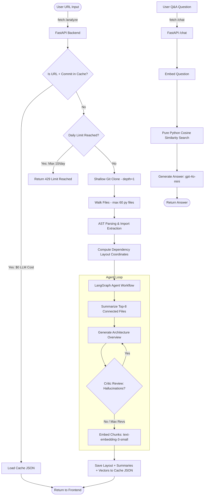

# RepoMind: AI Codebase Onboarding Assistant

RepoMind is a budget-conscious codebase onboarding assistant that takes a GitHub repository URL and generates:
1. **Interactive Dependency Graph**: Rendered client-side using Python NetworkX layouts and Vis.js.
2. **Architecture Synthesis**: Summarizes the repository's technology stack and organization using a LangGraph multi-agent loop with critic verification.
3. **"Start Here" Guide**: A curated checklist of entry-point files to help a developer onboard quickly.
4. **Codebase Q&A Chat**: A serverless RAG interface powered by cached embeddings and pure-Python vector similarity matching.

---

## Repository Structure

The project is split into two independent folders to support serverless deployment targets:

*   **`frontend/`**: Contains pure static HTML, CSS, and JS. It is optimized to be hosted on **GitHub Pages** (completely serverless, $0 hosting cost).
*   **`backend/`**: A Python FastAPI service deployed to **Hugging Face Spaces** (Free Docker tier). It runs the LangGraph analysis loop, local dependency parsing, caching, and holds the OpenAI API key securely as a secret.

---

## System Architecture



---

## Cost-Control Safeguards

To prevent unexpected usage and control OpenAI API expenditures, RepoMind implements several overlapping layers of cost safeguards:

1.  **Pure Python parsing ($0 cost)**: Repository cloning, file walking, AST import extraction, and dependency graph layout coordinates calculation are performed entirely in Python, incurring zero LLM charges.
2.  **File Cap & Filtering**: Ignores lockfiles, caches, `node_modules`, `.git`, and virtual environments. Traversal caps file analysis at a maximum of **60 files**.
3.  **Strict Cache Lookup**: All LLM outputs, graph coordinate positions, and vector embeddings are saved in JSON format, keyed by the repository URL and the commit hash. Re-analyzing an unchanged repository draws instantly from cache for $0.
4.  **Daily New Repo Cap**: New (non-cached) analyses are rate-limited to a maximum of **10 per day** via a persistent JSON tracker file.
5.  **Pre-baked Demo Repos**: Pre-analyzed repos (such as `RepoMind` itself) load instantly and bypass both rate-limits and LLM calls since their analysis payloads are bundled in `demo_cache/`.
6.  **Granular Token Limits**: `max_tokens` constraints are strictly declared on every LLM call (summaries capped at 60 tokens, architecture at 400 tokens, critic reviews at 100 tokens, and Q&A responses at 200 tokens).
7.  **Server-Side Secret Containment**: All OpenAI credentials reside securely in Hugging Face Spaces' repository secrets.

---

## Deployment & Setup

### 1. Deploying the Backend (Hugging Face Spaces)
1. Log in to [Hugging Face](https://huggingface.co/) and create a new **Space**.
2. Set the **SDK** to **Docker** and choose the **Blank** template.
3. In the Space **Settings**:
   - Add a Repository Secret called `OPENAI_API_KEY` and input your OpenAI API Key.
4. Clone the space, copy the contents of the local `backend/` folder into it, and push to main.

### 2. Deploying the Frontend (GitHub Pages)
1. Open [frontend/app.js](file:///Users/jimmycodes/RepoMind/frontend/app.js) and replace the `BACKEND_URL` fallback placeholder with your live Hugging Face Space URL (e.g. `https://your-username-your-space-name.hf.space`).
2. Push only the `frontend/` directory to the `gh-pages` branch on GitHub:
   ```bash
   git subtree push --prefix frontend origin gh-pages
   ```
3. In your GitHub Repository, navigate to **Settings** -> **Pages**:
   - Set the branch to `gh-pages` and directory to `/ (root)`.
   - Click **Save**. Your static frontend will be live on `https://your-username.github.io/your-repo-name`.

---

## Local Development Setup

To run the application locally:

1. Navigate to the `backend/` directory:
   ```bash
   cd backend
   ```
2. Create and populate the environment configuration:
   ```bash
   cp .env.example .env
   # Add your OPENAI_API_KEY inside the .env file
   ```
3. Create a virtual environment and install dependencies:
   ```bash
   python3 -m venv .venv
   source .venv/bin/activate
   pip install -r requirements.txt
   ```
4. Run the FastAPI development server:
   ```bash
   uvicorn main:app --reload --port 8000
   ```
5. Open `frontend/index.html` directly in your browser or run a simple local web server:
   ```bash
   cd ../frontend
   python3 -m http.server 8080
   ```
   Access the UI at `http://localhost:8080`.
